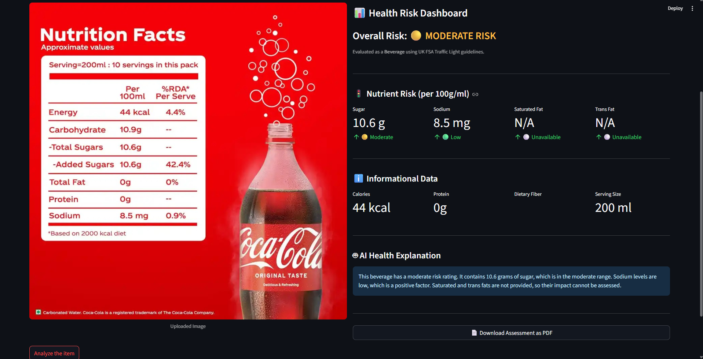
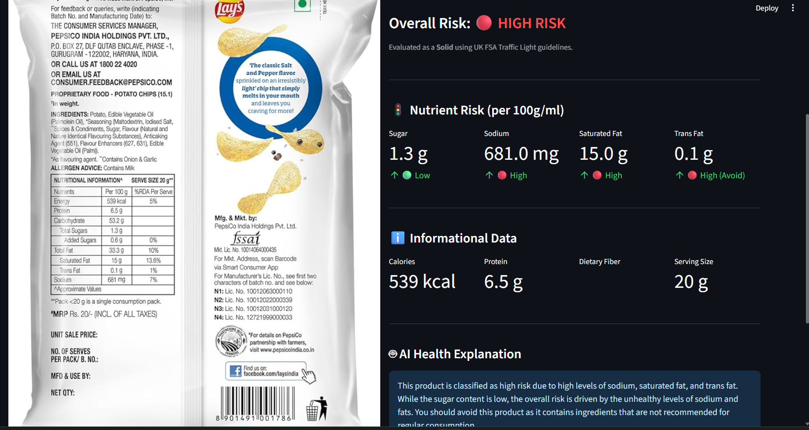

# 🥫 Food Label AI

Food Label AI is a Streamlit application that analyzes nutrition labels from food package images using local Large Language Models (LLMs). It extracts structured nutrition information, evaluates health risks using UK FSA Traffic Light guidelines, generates AI-based health explanations, and allows users to download a PDF assessment report.

---

## Features

- 📷 Upload food label images (JPG, JPEG, PNG)
- 👁️ Extract structured nutrition information using Qwen2.5-VL
- 🧾 Normalize extracted JSON using Qwen3
- ✅ Validate nutritional values to prevent LLM hallucinations
- 🚦 Evaluate Sugar, Sodium, Saturated Fat, and Trans Fat using UK FSA Traffic Light guidelines
- 🤖 Generate concise AI health explanations
- 📊 Interactive health risk dashboard
- 📄 Download assessment as a PDF report
- 🔒 Runs completely locally using Ollama (No API Keys)

---

## Tech Stack

- Python
- Streamlit
- Ollama
- Qwen2.5-VL (Vision Language Model)
- Qwen3 8B
- LangChain
- FPDF

---

## Workflow

```
Food Label Image
        │
        ▼
Qwen2.5-VL
(Image Understanding)
        │
        ▼
Structured JSON Extraction
        │
        ▼
Qwen3
(JSON Normalization)
        │
        ▼
Numeric Integrity Validation
        │
        ▼
UK FSA Risk Assessment
        │
        ▼
AI Health Explanation
        │
        ▼
Dashboard + PDF Report
```

---

## Dashboard

### Beverage Example



---

### Snack Example



---

## Installation

Clone the repository

```bash
git clone https://github.com/<your-username>/Food-Label-AI.git
cd Food-Label-AI
```

Create a virtual environment

```bash
python -m venv .venv
```

Activate it

### Windows

```bash
.venv\Scripts\activate
```

Install dependencies

```bash
pip install -r requirements.txt
```

Run Ollama models

```bash
ollama pull qwen2.5vl:7b
ollama pull qwen3:8b
```

Start the application

```bash
streamlit run app.py
```

---

## Project Structure

```
Food-Label-AI/
│── app.py
│── README.md
│── requirements.txt
│── .gitignore
│
├── assets/
│   ├── dashboard_beverage.png
│   ├── dashboard_snacks.png
│   └── report.png
│
└── sample_images/
```

---

## Risk Assessment

The application evaluates the following nutrients according to **UK FSA Traffic Light Guidelines**:

- Sugar
- Sodium
- Saturated Fat
- Trans Fat

Based on these evaluations, the application classifies the product as:

- 🟢 Low Risk
- 🟡 Moderate Risk
- 🔴 High Risk

---

## PDF Report

The generated report includes:

- Product information
- Overall health risk
- Nutrient-wise assessment
- AI-generated health explanation

---

## Future Improvements

- Barcode scanning
- Nutrition history
- Batch image analysis
- Product comparison

---

## License

MIT License